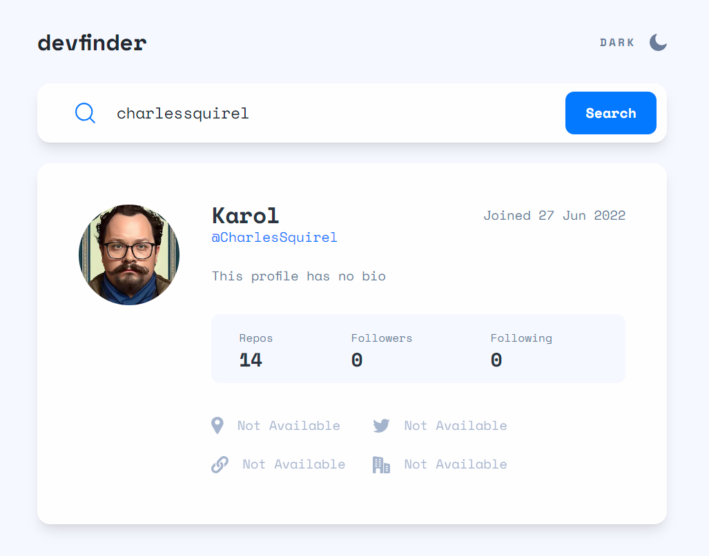
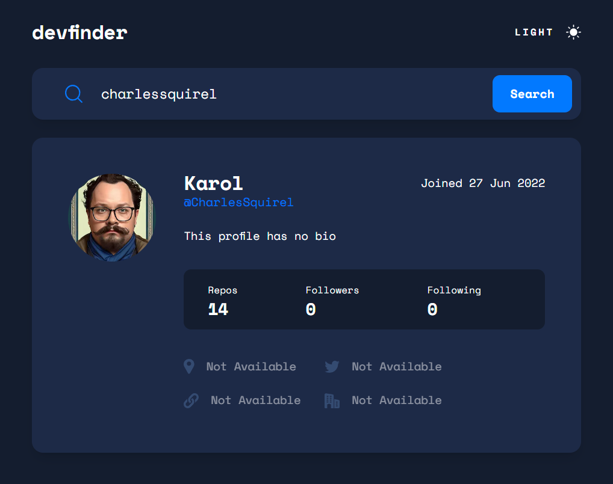
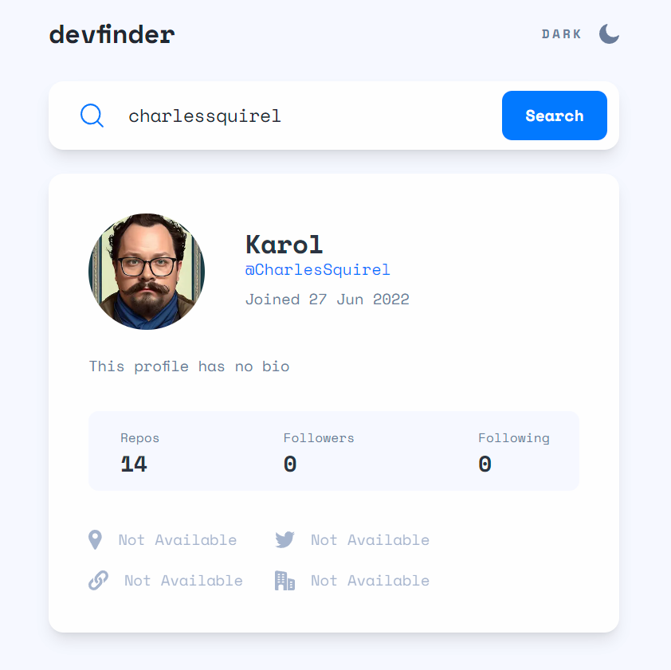
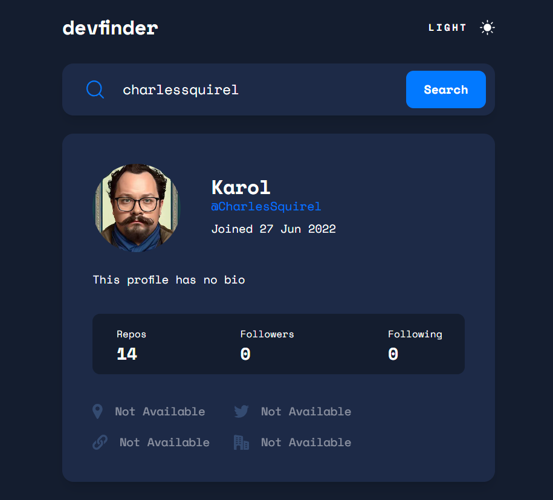
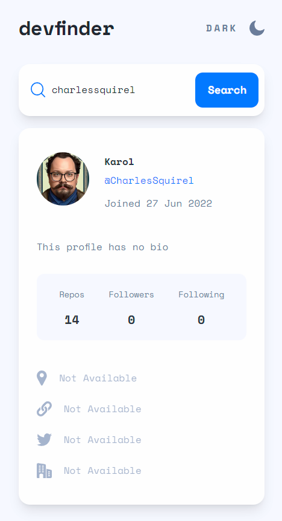
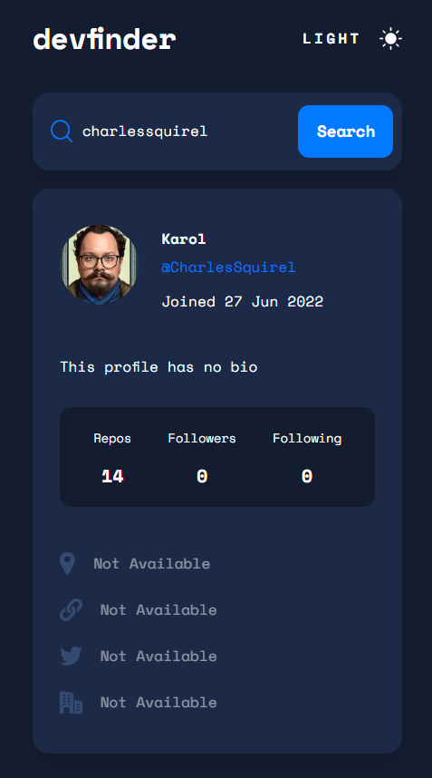

# Frontend Mentor - GitHub user search app solution

This is my first project after a long break from coding. A very good warm-up in which I learned something new - implementing dark mode with tailwind. By the way, working with the tailwind, especially with RWD, is very pleasant. As a reminder, I added simple unit tests to refresh this topic a bit.
This is a solution to the [GitHub user search app challenge on Frontend Mentor](https://www.frontendmentor.io/challenges/github-user-search-app-Q09YOgaH6).

## Table of contents

- [Overview](#overview)
  - [The challenge](#the-challenge)
  - [Screenshot](#screenshot)
  - [Links](#links)
- [My process](#my-process)
  - [Built with](#built-with)
  - [What I learned](#what-i-learned)
  - [Continued development](#continued-development)
  - [Useful resources](#useful-resources)
- [Author](#author)

## Overview

### The challenge

Users should be able to:

- View the optimal layout for the app depending on their device's screen size
- See hover states for all interactive elements on the page
- Search for GitHub users by their username
- See relevant user information based on their search
- Switch between light and dark themes

### Screenshot

<div style="width: 830px; display: flex; justify-content: space-beetwen">
  
  
</div>
<div style="width: 830px; display: flex; justify-content: space-beetwen">
  
  
</div>
<div style="width: 830px; display: flex; justify-content: space-beetwen">
  
  
</div>

### Links

- Solution URL: [Add solution URL here](https://github.com/CharlesSquirel/github-frontendmentor)
- Live Site URL: [Add live site URL here](https://github-frontendmentor.vercel.app/)

## My process

### Built with

- 
- 
- 
- 
- 
- 

### What I learned

Custom hook using context:

```js
export const useCustomHookWithContext =
  () => {
    const context =
      useContext(myContext);
    if (context === undefined) {
      throw new Error(
        'Context must be within context provider'
      );
    }
    return context;
  };
```

### Useful resources

- [Dark mode tailwind guide](https://prismic.io/blog/tailwind-css-darkmode-tutorial) - The new topic is primarily dark mode and its support in tailwind. I searched a bit on the Internet, where there are a lot of articles on this subject, but in the end I found this article described very well.

## Author

- Github - [@CharlesSquirel](https://www.github.com/CharlesSquirel)
- Frontend Mentor - [@CharlesSquirel](https://www.frontendmentor.io/profile/CharlesSquirel)
